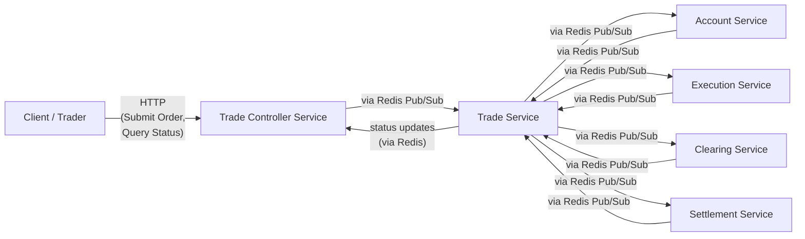
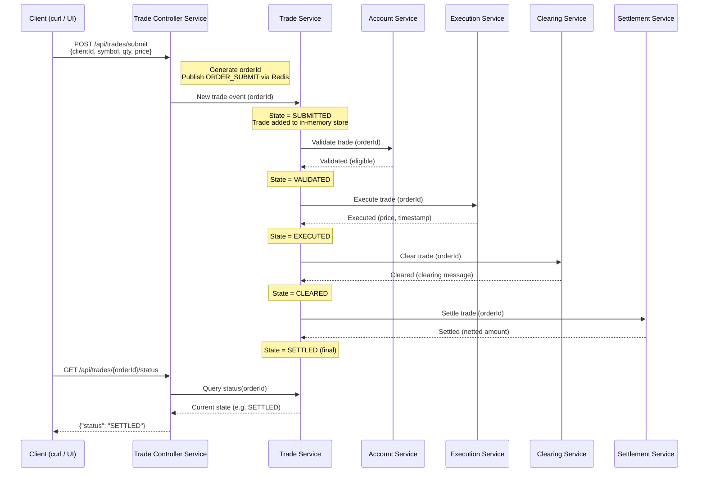
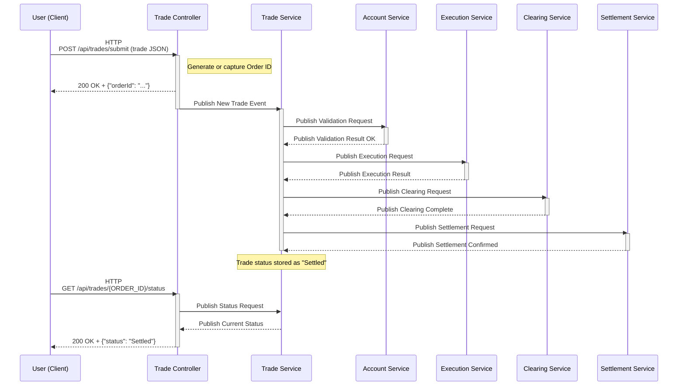
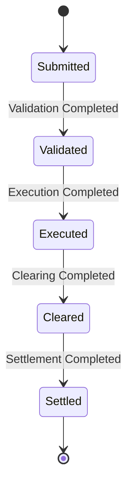

# KLEAR System

A microservice-based, event-driven demonstration trading platform for order submission, validation, execution, clearing, and settlement. The system is deliberately architected as a set of decoupled Spring Boot microservices communicating via Redis Pub/Sub, with a REST-facing Trade Controller as the entry point.

This README covers:

* System and service overview
* Architecture and message flow (with Mermaid diagrams)
* Building the system with Maven
* Running the full stack via **Docker Compose** (Maven-based + Dockerfile-based variants)
* Manual (non-Docker) run instructions
* Testing and trade lifecycle walkthrough
* Future work and productionisation directions
* Full deep-dive narrative of the architecture and design decisions

---



**Diagram:** Overall system architecture. Solid arrows indicate the flow of trade events through the services (all inter-service communication is asynchronous via Redis Pub/Sub channels). The Trade Controller receives HTTP requests from the client and interacts with the Trade Service internally via Redis. The Trade Service orchestrates the trade through Account, Execution, Clearing, and Settlement services, each of which responds back via Redis. (For simplicity, the Redis message broker and the specific pub/sub channels are not drawn explicitly, but every inter-service arrow represents a Redis-mediated message exchange.)

---

# 📑 Table of Contents

0. [Quick Start](#quick-start)
    * [Start the system](#start-the-system)
    * [Submit a trade](#submit-a-trade)
    * [What to look for in the logs](#what-to-look-for-in-the-logs-concrete-example)
    * [Query the order status](#query-the-order-status)
    * [Stop the system](#stop-the-system)
    * [Order Lifecycle (Service-to-Service Flow)](#order-lifecycle-service-to-service-flow)
1. [Introduction](#1-introduction)
2. [System Overview (High-Level)](#2-system-overview-high-level)
3. [Services Overview (Detailed)](#3-services-overview-detailed)
    * [Trade Controller Service](#31-trade-controller-service)
    * [Trade Service](#32-trade-service)
    * [Account Service](#33-account-service)
    * [Execution Service](#34-execution-service)
    * [Clearing Service](#35-clearing-service)
    * [Settlement Service](#36-settlement-service)
4. [System Architecture Diagram](#4-system-architecture-diagram)
5. [Client Libraries](#5-client-libraries)
6. [Microservice Architecture Deep Dive](#6-microservice-architecture-deep-dive)
    * [Event-Driven Architecture](#61-event-driven-architecture)
    * [Independent Threading Model](#62-independent-threading-model)
    * [Distributed Systems Principles](#63-distributed-systems-principles)
    * [Scalability and Fault Tolerance](#64-scalability-and-fault-tolerance)
    * [Clean and Elegant Design](#65-clean-and-elegant-design)
7. [Trade Lifecycle – Sequence & State Diagrams](#7-trade-lifecycle--sequence--state-diagrams)
    * [Sequence Diagram – Happy Path](#71-sequence-diagram--trade-lifecycle-happy-path)
    * [Trade State Machine](#72-trade-state-machine-critical-path)
8. [Building the KLEAR System (Maven)](#8-building-the-klear-system-maven)
    * [Prerequisites](#81-prerequisites)
    * [Build All Modules](#82-build-all-modules)
    * [Build Individual Services](#83-build-individual-services-optional)
    * [Dockerfile-based Image Build](#84-optional-building-docker-images-dockerfile-based-approach)
9. [Running the KLEAR System with Docker Compose](#9-running-the-klear-system-with-docker-compose-recommended)
    * [Prerequisites](#91-prerequisites)
    * [Variant 1 – Maven in Container](#92-docker-compose-variant-1--maven-in-container-no-dockerfiles-required)
    * [Variant 2 – Dockerfile-Based](#93-docker-compose-variant-2--dockerfile-based-pre-built-images)
    * [Verification & Monitoring](#94-verification--monitoring)
10. [Running the KLEAR System Manually](#10-running-the-klear-system-manually-without-docker)
11. [Testing the KLEAR System](#11-testing-the-klear-system)
    * [Submitting a Trade](#111-submitting-a-trade)
    * [Querying Trade Status](#112-querying-the-trade-status)
    * [Following the Lifecycle via Logs](#113-following-the-trade-lifecycle-via-logs)
12. [Future Work](#12-future-work)
    * [Non-Critical Path State Machine](#121-completing-the-non-critical-path-state-machine)
    * [Logging Improvements](#122-implementing-proper-logging)
    * [Service Discovery](#123-service-discovery-with-eureka-or-similar)
    * [Failover & Circuit Breakers](#124-adding-failover-and-circuit-breakers)
    * [Scalability Enhancements](#125-scalability-enhancements-horizontal-vertical-orthogonal)
    * [Deployment in AWS](#126-deployment-in-aws-with-vpc-subnet-segmentation)
    * [Full Microservice Development](#127-full-scale-development-of-microservices)
    * [Third-Party Integration](#128-extending-the-system-for-third-party-integration)
13. [Conclusion](#13-conclusion)
    * [Key Strengths](#131-key-strengths-of-the-current-system)
    * [Future Work Summary](#132-future-work-and-enhancements-summary)
    * [Final Thoughts](#133-final-thoughts)
14. [Appendix: docker-compose.yml](#appendix-docker-composeyml-maven-based-variant)


---

## Quick Start

This section gets you from zero to “trade submitted and visible in logs” as fast as possible.

### Start the system

From the repository root (where `docker-compose.yml` lives):

```bash
docker compose up
````

On first run:

* Docker will pull images and Maven will build the modules inside the containers.
* You’ll see the six services start up:

    * `klear-redis`
    * `klear-trade-controller`
    * `klear-trade-service`
    * `klear-account-service`
    * `klear-execution-service`
    * `klear-clearing-service`
    * `klear-settlement-service`

You should see logs like:

```text
klear-trade-controller | :: Spring Boot :: (v3.2.10)
klear-trade-service    | :: Spring Boot :: (v3.2.10)
klear-account-service  | :: Spring Boot :: (v3.2.10)
...
klear-trade-controller | Tomcat started on port 8080 (http)
```

That means the public REST API is live on `http://localhost:8080`.

If you prefer detached mode:

```bash
docker compose up -d
docker compose logs -f    # follow logs
```

---

### Submit a trade

In another terminal, submit a trade via the public REST API:

```bash
curl -X POST http://localhost:8080/api/trades/submit \
  -H "Content-Type: application/json" \
  -d '{
        "clientId": "123456",
        "stockSymbol": "AAPL",
        "quantity": 100,
        "price": 150.0
      }'
```

Example response:

```text
  Order submitted successfully. Order ID: "6f8e3bb7-01ec-4ecf-81e7-f548be295485"
```

That `orderId` is your primary key for this trade.

Under the hood, for that ID the following has happened:

1. `trade-controller` accepted the HTTP request and logged the `SubmitOrder` payload.
2. It created a Redis **return channel** and published the order to the **Trade Service**.
3. `trade-service` picked it up and moved it into the lifecycle (Submitted → Validated → Executed → Cleared → Settled).

---

### What to look for in the logs (concrete example)

Keep `docker compose logs -f` running and grep for your `orderId`.
For the example above (`6f8e3bb7-01ec-4ecf-81e7-f548be295485`), the logs look like this:

```text
# REST controller receives the order and publishes it into the system
klear-trade-controller | SubmitOrder:    {"type":"ORDER_SUBMIT","returnChannel":"trade_service_channel_RET_9cfeedb1-1b4a-4924-8551-cedc7928454c","payload":{"clientId":"123456","stockSymbol":"AAPL","quantity":100,"price":150.0}}

# Trade Service accepts and starts the lifecycle
klear-trade-service    | submitOrder:    6f8e3bb7-01ec-4ecf-81e7-f548be295485
klear-trade-service    | ServiceClient: send: {"type":"SEND","returnChannel":"account_service_channel_RET_1c1998ff-e241-47e9-ab39-1dcd4adb2f79","payload":{"orderId":"6f8e3bb7-01ec-4ecf-81e7-f548be295485", ... "status":"UNKNOWN", ... }}

# Account validation
klear-account-service  | Validated: 6f8e3bb7-01ec-4ecf-81e7-f548be295485
klear-trade-service    | Validated: 6f8e3bb7-01ec-4ecf-81e7-f548be295485
klear-trade-service    | ServiceClient: send: {"type":"SEND","returnChannel":"execution_service_channel_RET_dbd3deac-f3d9-4db2-b160-fa980efe16cd","payload":{"orderId":"6f8e3bb7-01ec-4ecf-81e7-f548be295485", ... "status":"VALIDATED", ... }}

# Execution
klear-execution-service | Executed:  6f8e3bb7-01ec-4ecf-81e7-f548be295485
klear-trade-service     | Executed:  6f8e3bb7-01ec-4ecf-81e7-f548be295485
klear-trade-service     | ServiceClient: send: {"type":"SEND","returnChannel":"clearing_service_channel_RET_4c7beb19-7e4b-4272-8bdd-45272359cdd7","payload":{"orderId":"6f8e3bb7-01ec-4ecf-81e7-f548be295485", ... "status":"EXECUTED", ... }}

# Clearing
klear-clearing-service  | Cleared:   6f8e3bb7-01ec-4ecf-81e7-f548be295485
klear-trade-service     | Cleared:   6f8e3bb7-01ec-4ecf-81e7-f548be295485
klear-trade-service     | ServiceClient: send: {"type":"SEND","returnChannel":"settlement_service_channel_RET_44d11ebf-56cd-42cf-b6ec-44f7e322e2fe","payload":{"orderId":"6f8e3bb7-01ec-4ecf-81e7-f548be295485", ... "status":"CLEARED", ... }}

# Settlement
klear-settlement-service | Settled:   6f8e3bb7-01ec-4ecf-81e7-f548be295485
klear-trade-service      | Settled:   6f8e3bb7-01ec-4ecf-81e7-f548be295485
```

That sequence shows the order’s lifecycle bouncing through the system.

The **high-level flow** you want to see, for any `orderId`, is:

```text
trade-controller
  → trade-service
  → account-service
  → trade-service
  → execution-service
  → trade-service
  → clearing-service
  → trade-service
  → settlement-service
  → trade-service (final state = Settled)
```

If you see that pattern, the entire lifecycle from inception → validation → execution → clearing → settlement is working as intended.

---

### Query the order status

From the outside, you can check where the trade currently is in the lifecycle via REST:

```bash
curl -X GET http://localhost:8080/api/trades/{ORDER_ID}/status
```

For the example order ID above:

```bash
curl -X GET http://localhost:8080/api/trades/6f8e3bb7-01ec-4ecf-81e7-f548be295485/status
```

Example responses as the trade progresses:

```json
{"status": "SUBMITTED"}
{"status": "VALIDATED"}
{"status": "EXECUTED"}
{"status": "CLEARED"}
{"status": "SETTLED"}
```

Internally, this status is managed by the **Trade Service** state machine; externally, you just see the current state exposed via the Trade Controller’s REST API.

---

### Stop the system

When you’re done:

```bash
docker compose down
```

This stops all containers (your source code stays in place).


---

### Order Lifecycle (Service-to-Service Flow)

This diagram shows the lifecycle of a single order as it moves through the KLEAR System, matching the example logs above.



This is the same lifecycle you can observe empirically by:

1. Submitting a trade via `curl`.
2. Grepping for the `orderId` in `docker compose logs -f`.
3. Hitting the status endpoint and watching the state transition through `SUBMITTED → VALIDATED → EXECUTED → CLEARED → SETTLED`.


---


## 1. Introduction

The KLEAR System is a demonstration project designed to provide an API as a front-end, public-facing service for an execution, clearing, and settlement platform. It leverages a microservice architecture where each component is decoupled and follows the Single Responsibility Principle. This design allows for easier maintenance, deployment, and independent scalability of each service.

At its core, the system uses a publish/subscribe (Pub/Sub) model for communication between services, where information is exchanged on topics through Redis. Each microservice is built with Spring Boot, and the system is designed to scale in three dimensions—horizontally, vertically, and orthogonally—based on demand. This approach supports independent scaling and simplifies the architecture, making it easier for engineers to understand, work on, and extend each service individually.

The design decisions of the KLEAR System are rooted in achieving strong decoupling and high cohesion. By adhering to the Single Responsibility Principle, the system ensures that each microservice performs one distinct function, improving readability and manageability. This architecture also enables junior engineers to take ownership of smaller components, reducing the complexity of their work while increasing the overall efficiency of the team. Additionally, this design simplifies testing, deployment, and scaling of each service without requiring the entire system to be operational, thus enhancing flexibility in development and maintenance.

---

## 2. System Overview (High-Level)

The KLEAR System is a demonstration trading platform that exposes a public API for submitting trades and querying their lifecycle. Internally, it uses a microservice architecture where each service has a single, clearly defined responsibility and communicates asynchronously via Redis.

Key characteristics:

* **Microservices**:

    * Trade Controller Service (REST API)
    * Trade Service (lifecycle orchestrator)
    * Account Service (eligibility & margin-style validation)
    * Execution Service (simulated execution / SOR entry point)
    * Clearing Service (post-trade clearing)
    * Settlement Service (final settlement)
* **Communication**: Redis Pub/Sub, using well-defined channel names
* **Concurrency model**: each service has independent inbound and outbound processing
* **Scalability**: designed for horizontal, vertical, and orthogonal scaling
* **Technology**: Java 17+, Spring Boot, Maven, Redis

---

## 3. Services Overview (Detailed)

The KLEAR System is built around six primary microservices, all designed to be decoupled and to scale efficiently. Each service can scale according to the Scale Cube model: horizontally (by adding more instances), vertically (by increasing resources for individual instances), and orthogonally (by sharding or partitioning workloads).

Below is an overview of each service and its role within the system, incorporating both the concise and deep-dive descriptions.

### 3.1 Trade Controller Service

The Trade Controller Service serves as the public-facing REST API for the KLEAR System (in a production cloud environment, this would reside in a public subnet). It exposes two main endpoints to external clients:

* Submit Order API: Accepts incoming trade orders and returns a unique order ID in response.
* Order Status API: Allows querying the status of a trade using the order ID.

**Role:** Public-facing REST API and entry point.

* Exposes:

    * `POST /api/trades/submit` — submit a new trade
    * `GET /api/trades/{orderId}/status` — query the current status of a trade
* Responsibilities:

    * Accept JSON trade payloads
    * Assign or pass through an order ID
    * Publish trade requests into the Trade Service via Redis
    * Relay status responses from the Trade Service back to clients
* Network:

    * Listens on **port 8080**
    * In a cloud deployment, this would sit in a public subnet / DMZ

This service acts as the entry point for external requests. It communicates internally with the Trade Service via the Trade Service Client, using Redis Pub/Sub for message exchange. By design, the Trade Controller is kept lightweight and stateless—its primary job is to validate the basic request format, forward the trade request into the system, and immediately return an acknowledgment (the order ID). All heavy lifting and state management of the trade lifecycle are handled by downstream services.

### 3.2 Trade Service

The Trade Service is the core orchestrator that coordinates the entire trade lifecycle. Upon receiving a trade request (via the Trade Controller and Redis), the Trade Service manages the state transitions of that trade from initial validation, through execution, to clearing and settlement. It communicates with the other services—Account, Execution, Clearing, and Settlement—by publishing and subscribing to Redis channels (encapsulated by client libraries) to ensure loose coupling and efficient data flow.

Crucially, the Trade Service is designed to handle multiple trades independently and concurrently. Trades move through the pipeline without blocking each other. For example, one trade can be in the execution phase while another is already in clearing, and a third is being validated, all in parallel. This non-blocking design ensures high throughput and low latency for processing trades.

The Trade Service also maintains an in-memory data store (a simple hash map or similar) to track the state of each trade by its order ID, which is used to respond to status queries from the Trade Controller.

From an operational perspective:

* Receives new trade events from the Trade Controller (via Redis)
* Manages trade state from `Submitted` through `Settled`
* Invokes other services via Redis Pub/Sub:

    * Account Service for validation
    * Execution Service for execution
    * Clearing Service for clearing
    * Settlement Service for settlement
* Maintains an in-memory store of trades keyed by order ID
* Provides the current trade status when queried by the Trade Controller

Example configuration (from `services/trade-service/src/main/resources/application.properties`):

* `spring.application.name=trade-service`
* `redis_ip=localhost`
* `redis_port=6379`
* `<service>_channel_name` keys for the various channels

In Docker, `redis_ip` and `redis_port` are overridden via environment variables to point at the Redis container.

### 3.3 Account Service

The Account Service simulates the account validation process to check whether an account is eligible to place a trade. Before a trade proceeds to execution, the Trade Service uses the Account Service (via the Account Service Client) to ensure that the client’s account meets all requirements. This includes checking for sufficient funds or collateral, margin requirements, position limits, and any product-specific trading constraints. Only if the Account Service responds that the trade is valid (e.g., the account has enough balance and is allowed to trade the given instrument) will the Trade Service continue to the next stage of the trade lifecycle.

By isolating account validation in its own service, the system adheres to single responsibility and can easily be extended to integrate with real account databases or risk engines in a production scenario. It also means that account validation rules can be updated or scaled independently of the rest of the system.

Responsibilities recap:

* Receives validation requests from the Trade Service
* Performs eligibility / margin / funds-style checks (simulated)
* Returns a validation result to the Trade Service via Redis
* Ensures only valid trades advance to execution

### 3.4 Execution Service

The Execution Service is responsible for executing trades once they have passed validation. In a real-world system, this service would contain the smart order routing and execution logic to fill the trade at the best possible venues (e.g. internal order books or external exchanges). In the KLEAR System, the Execution Service simulates this behavior.

When the Trade Service sends a trade to the Execution Service (using the Execution Service Client and Redis), the Execution Service will "execute" the trade and then respond with the execution result. This could include details like the execution price and confirmation that the order has been filled. After execution, the trade (now with execution details) is handed back to the Trade Service for the subsequent clearing phase.

Currently, the Execution Service is a placeholder for where integration with actual exchange APIs or internal matching engines would occur. Its decoupled nature means that adding real execution logic or connecting to external trading venues can be done without affecting the other services.

Responsibilities recap:

* Receives execution requests from the Trade Service
* Simulates routing and execution (e.g. smart order routing placeholder)
* Publishes execution results (e.g. executed price/quantity) back to the Trade Service

In a production implementation, this service would:

* Maintain connectors to exchanges / venues
* Handle partial fills, time-in-force, and order routing logic

### 3.5 Clearing Service

The Clearing Service handles the clearing phase of the trade lifecycle. Clearing is the process of updating the trading parties' obligations to reflect the executed trade, typically including risk management and trade confirmation steps. In the KLEAR System, once a trade is executed, the Trade Service publishes a message to the Clearing Service (via the Clearing Service Client). The Clearing Service then performs the necessary clearing actions. This is simulated in the demo system, but in a realistic scenario it might involve communicating with a clearing house or performing margin calculations.

Upon completing its clearing process for the trade, the Clearing Service sends a confirmation back (through Redis) indicating that the trade has been cleared. The Trade Service, upon receiving this, will then proceed to the final settlement phase. The independence of the Clearing Service means it could be scaled or modified (for example, to handle different asset classes or connect to various clearinghouses) without impacting the rest of the system.

Responsibilities recap:

* Receives executed trades from the Trade Service
* Simulates clearing logic (e.g. risk updates, obligations netting)
* Publishes “clearing complete” events back to the Trade Service

### 3.6 Settlement Service

The Settlement Service is responsible for the final step in the trade’s lifecycle: settlement. Settlement is the actual exchange of assets or payments to conclude the trade (for example, the delivery of stock shares to the buyer and cash to the seller).

In the KLEAR System, after a trade is cleared, the Trade Service publishes the trade to the Settlement Service (using the Settlement Service Client). The Settlement Service will then simulate settling the trade. In a full implementation, this could involve updating balances in custody or bank accounts, interfacing with payment systems, or generating ledger entries.

Once the Settlement Service completes its task, it sends a confirmation back indicating the trade is settled/finalised. The Trade Service receives this confirmation and updates the trade’s status in its in-memory store to "Settled" (or completed). At this point, the trade’s lifecycle is complete. By isolating settlement in its own service, the system makes it easy to later integrate with real settlement networks or to handle various settlement workflows (such as T+2 settlements, multi-currency settlements, etc.) without affecting the rest of the pipeline.

Responsibilities recap:

* Receives cleared trades from the Trade Service
* Simulates final settlement (e.g. cash and asset movements)
* Publishes “settlement confirmed” events back to the Trade Service

---

## 4. System Architecture Diagram

The following diagram illustrates the overall architecture of the KLEAR system, showing the microservices and how they communicate via Redis Pub/Sub, as well as how external clients interact with the system.


**Diagram:** Overall system architecture. Solid arrows indicate the flow of trade events through the services (all inter-service communication is asynchronous via Redis Pub/Sub channels). The Trade Controller receives HTTP requests from the client and interacts with the Trade Service internally via Redis. The Trade Service orchestrates the trade through Account, Execution, Clearing, and Settlement services, each of which responds back via Redis. (For simplicity, the Redis message broker and the specific pub/sub channels are not drawn explicitly, but every inter-service arrow represents a Redis-mediated message exchange.)

---

## 5. Client Libraries

Communication between these microservices is facilitated by dedicated client libraries that abstract the details of message passing. Each client library encapsulates the logic of publishing to and subscribing from Redis channels for a specific service. This design allows the services to remain unaware of the underlying messaging implementation and simply call methods on these clients as if they were making local calls. If the messaging infrastructure changes (for example, switching from Redis to another broker), only the client libraries would need to be updated, leaving the core service logic untouched.

Here is an overview of each client library and its role in the system:

1. **Trade Service Client**
   Used by other services (primarily by the Trade Controller Service) to communicate with the Trade Service. This client handles:

    * Sending trade submission requests into the Trade Service’s input channel.
    * Querying the current status of a trade.
    * Receiving responses or status updates related to the trade’s lifecycle.

   For instance, when a trade is submitted via the Trade Controller, the Trade Service Client publishes the request to the Trade Service (via Redis). It also listens for responses, such as the results of trade validation, execution, clearing, and settlement. This decouples the Trade Controller from the Trade Service’s internal implementation.

2. **Account Service Client**
   Used by the Trade Service to interact with the Account Service for trade validation. This client:

    * Sends a validation request (containing trade details and account info) to the Account Service.
    * Waits (asynchronously) for the Account Service’s response indicating whether the account is allowed to proceed with the trade.

   This ensures that only trades with valid accounts and sufficient funds move forward to execution. All of this communication happens via Redis messages, abstracted away by the client library.

3. **Execution Service Client**
   Used by the Trade Service to send trades to the Execution Service for execution. After a trade is validated, the Trade Service uses the Execution Service Client to publish an execution request (which includes details like the order parameters) to the Execution Service. The Execution Service processes the trade (e.g., simulating routing to an exchange) and then responds.

   The Execution Service Client receives this execution result (which might include fill price, quantity executed, etc.) and delivers it back to the Trade Service. This client thus allows the Trade Service to trigger trade execution without being directly dependent on how execution is implemented.

4. **Clearing Service Client**
   Used by the Trade Service to send executed trades to the Clearing Service. Once execution is complete, the Trade Service invokes the Clearing Service Client to publish a clearing request to the Clearing Service. The Clearing Service then performs its task and sends a confirmation or result message, which the Clearing Service Client picks up and provides to the Trade Service.

   This pattern allows the Trade Service to initiate clearing and continue with other work, knowing that the clearing result will asynchronously arrive when ready.

5. **Settlement Service Client**
   Used by the Trade Service to send cleared trades to the Settlement Service for final settlement. Similar to the above clients, the Trade Service uses this client to publish a settlement request message to the Settlement Service. The Settlement Service completes the settlement and publishes a confirmation message. The Settlement Service Client listens for this confirmation and relays it back to the Trade Service.

   Upon receiving this through the client, the Trade Service knows the trade lifecycle is complete and updates the trade’s status to settled. This client encapsulates the final leg of the trade’s journey.

Each of these client libraries enables decoupled, asynchronous communication between services. They make the system **message-broker agnostic** — for example, if we wanted to replace Redis with another messaging system (Kafka, RabbitMQ, etc.), we could implement new client libraries with the same interfaces. The business logic in the services would remain unchanged, illustrating the power of this abstraction in a microservice architecture.

---

## 6. Microservice Architecture Deep Dive

The KLEAR System’s architecture is event-driven, emphasizing decoupling and concurrency. Each microservice operates autonomously, reacting to events (messages) and emitting events as needed. This section dives deeper into how the system is built for scalability, fault tolerance, and clean separation of concerns.

### 6.1 Event-Driven Architecture

At the core of the system is an event-driven design. Services do not call each other directly; instead, they communicate by publishing events to Redis channels and subscribing to the channels relevant to them. For example, when the Trade Service has finished validating a trade, it publishes an "execute trade" event that the Execution Service is listening for. Likewise, when execution is done, the Execution Service publishes a "trade executed" event for the Trade Service to pick up and forward to Clearing, and so on.

This publish/subscribe mechanism means that services are loosely coupled – the Trade Service doesn’t need to know who will execute the trade, only that if it publishes the execution request, some service will handle it.

Benefits:

* Asynchronous processing: each service can work at its own pace and handle many requests in parallel.
* Services can be added, removed, or updated without affecting others, as long as they adhere to the event contract (message formats and channel topics).
* Resilience to load: if one service is slow, messages queue up in Redis, but other services can continue operating on other trades independently.

### 6.2 Independent Threading Model

Each microservice in the KLEAR System employs a minimal two-thread model to maximize concurrency and throughput:

* **Inbound Thread**: A thread dedicated to listening for incoming messages/events from Redis. For instance, in the Execution Service this thread waits for "execute trade" events. When a message arrives (carrying, say, the details of a trade to execute), this thread wakes up and processes the incoming event.
* **Outbound Thread**: A separate thread dedicated to sending out messages/events to Redis. After the service processes an event, any resulting action or response is published via this outbound thread. For example, once the Execution Service has executed a trade, it uses the outbound thread to publish a "trade executed" event (with results) back to the Trade Service.

By separating inbound and outbound processing, the critical path of handling a request and the critical path of producing a response are completely decoupled within each service. An inbound thread can immediately go back to listening for the next message as soon as it hands off the result to the outbound thread. Conversely, the outbound thread can continue to push out results even if the inbound thread is busy handling new requests.

This yields a clean concurrency model where reading and writing (in terms of message streams) do not block each other. It takes full advantage of multi-core systems by allowing each service to handle multiple messages simultaneously (and we can increase the number of threads or instances for more parallelism as needed).

### 6.3 Distributed Systems Principles

The architecture embodies key distributed systems principles:

* **Decoupling**: Services are not directly dependent on each other’s availability or implementation. They share information only via messages. This decoupling reduces the risk that a failure in one service will directly crash another. Each service can also evolve independently (e.g., one could be rewritten in another language or replaced with a more advanced version) as long as it respects the message interface.
* **Asynchronous Communication**: By using non-blocking message passing, the system avoids the latency of synchronous RPC calls. No service waits idly for another; instead, it can do other work or handle other messages. This is crucial for high-throughput systems like trading platforms, where waiting for a sequential call could severely bottleneck performance.
* **Concurrency and Parallelism**: The use of multiple threads (and the ability to run multiple instances of each service) means the system processes many trades in parallel. There is no global sequential bottleneck; each stage of different trades can proceed concurrently. For example, 100 trades could all be in-flight at once at different stages (some validating, some executing, etc.), limited only by computing resources and Redis throughput.
* **Stateless Processing**: Aside from the Trade Service’s in-memory status store (which is lightweight and for convenience), each service is largely stateless between requests, relying on messages to carry the necessary context. This makes horizontal scaling (adding more instances) trivial because any instance can handle any message of the type it’s subscribed to.

### 6.4 Scalability and Fault Tolerance

This event-driven microservice architecture is naturally scalable and fault-tolerant:

* **Horizontal Scaling**: Since services communicate via a broker, we can scale out any service by running multiple instances subscribed to the same channel. For example, if trading volume grows, we could start additional Execution Service instances on different machines; Redis will load-balance messages (roughly) by delivering each new execution request to one of the available subscribers. Similarly, multiple Trade Service instances could share the load of incoming trades.
* **Vertical Scaling**: Each service can also be given more resources (CPU, memory) if needed, and the multi-threaded design within the service will make use of those resources to handle more messages concurrently.
* **Orthogonal Scaling (Sharding)**: In the future, we can partition workload by distinct criteria (e.g., asset class). Because the system is already segmented by function, adding such sharding is an orthogonal concern (we can duplicate a whole pipeline for a subset of trades if needed without changing the core logic).
* **Fault Isolation**: If one service fails or becomes slow, the rest of the system remains largely unaffected. For example:

    * If the Settlement Service goes down, trades can still be submitted, validated, and executed; they will queue up at the clearing stage waiting for settlement to be available.
    * The Trade Service will continue to accept new trades and just mark those trades as "executed, awaiting settlement".
    * Once the Settlement Service comes back up, it can resume processing the backlog of messages.
    * Similarly, if the Execution Service is slow, trades will be validated and then wait in Redis until an Execution Service instance picks them up.

This isolation prevents cascading failures and allows for graceful degradation.

Redis can also buffer messages (to a limit) and can be configured for persistence, reducing the risk of message loss during restarts or scaling events.

### 6.5 Clean and Elegant Design

Despite the complexity of a distributed trading platform, the design of the KLEAR System remains clean and elegant due to its modular structure:

* Every service has a single, well-defined responsibility and communicates through well-defined channels.
* The concurrency model (inbound/outbound threads and asynchronous events) is simple to understand yet powerful.
* Testing and development are simplified by the event-driven, decoupled nature of the services.
* Extensibility is straightforward: adding a new service (e.g. Compliance Service) is primarily a matter of defining new channels and interactions without disturbing existing services.

In summary, the architecture emphasises decoupling, asynchronous communication, and clear separation of concerns, which are all key to building a high-throughput, reliable distributed system.

---

## 7. Trade Lifecycle – Sequence & State Diagrams

### 7.1 Sequence Diagram – Trade Lifecycle (Happy Path)

This sequence diagram describes the **happy path** trade lifecycle for a single order.



**Diagram:** Sequence of events for a single trade. The user submits a trade via HTTP to the Trade Controller, which immediately returns an order ID and publishes the trade to the Trade Service. The Trade Service orchestrates the trade through validation (Account Service), execution (Execution Service), clearing (Clearing Service), and settlement (Settlement Service) by exchanging events through Redis. Once settled, the Trade Service records the final status. The user then queries the status via HTTP, and the Trade Controller fetches the latest state from the Trade Service (which, at that point, is "Settled"). All inter-service calls are asynchronous and happen via Redis Pub/Sub messages, allowing the user to retrieve the status at any time.

### 7.2 Trade State Machine (Critical Path)

From the Trade Service’s perspective, each trade moves through the following state machine on the **critical (happy) path**:



**Diagram:** Trade state machine for the critical (successful) path. A trade goes from Submitted to Validated, Executed, Cleared, and Settled. Each transition is triggered by the completion of the respective phase. (Error handling and alternative paths, such as a failed validation or execution, would introduce additional states and transitions, which are part of future enhancements.)

---

## 8. Building the KLEAR System (Maven)

To build and package the KLEAR System from source, follow these steps to ensure all dependencies are resolved and the services are compiled correctly.

### 8.1 Prerequisites

Make sure you have the following installed on your system:

* Java Development Kit (JDK), preferably version 17 or higher.
* Apache Maven (for building the project).
* Docker and Docker Compose (required if you plan to containerize and run the system with Docker, as described later).
* (If running services manually without Docker) Redis installed or accessible locally on the default port `6379`.
  *Note:* With the Docker Compose approach, a Redis container will be provided, so a separate installation of Redis on your host is not necessary for that mode.

### 8.2 Build All Modules

The project is structured as a multi-module Maven project, with each microservice as a sub-module.

From the root directory of the project (`KlearSystem-main`, where the top-level `pom.xml` resides):

```bash
mvn clean install
```

This will:

* Clean any previous build artifacts.
* Compile all the source code of each service.
* Resolve and download all necessary dependencies.
* Package each service into its runnable JAR file (Spring Boot fat jar).

After this command completes successfully, you should have `target` directories for each service module containing the respective `.jar` files.

### 8.3 Build Individual Services (Optional)

During development, you might want to build or rebuild a single service without rebuilding everything. You can do this by navigating into a specific service’s directory and running:

```bash
# Trade Service
cd services/trade-service
mvn clean install

# Account Service
cd services/account-service
mvn clean install

# Execution Service
cd services/execution-service
mvn clean install

# Clearing Service
cd services/clearing-service
mvn clean install

# Settlement Service
cd services/settlement-service
mvn clean install

# Trade Controller
cd trade-controller
mvn clean install
```

This will compile and package just that service. You can find the output JAR in that service’s `target` directory. This is useful when making changes to one microservice at a time.

### 8.4 (Optional) Building Docker Images (Dockerfile-based Approach)

If you intend to run the system using Docker Compose with **pre-built Docker images** (rather than the Maven-in-container approach), you’ll need Docker images for each service.

* The repository can include Dockerfile definitions for each service module.
* After packaging the JARs via Maven, you can build all the Docker images using the Dockerfile-based Docker Compose configuration (see **Alternative Docker Compose (Dockerfile-based)** below).
* For example, running:

```bash
docker-compose -f docker-compose-dockerfiles.yml build
# or
docker-compose -f docker-compose-dockerfiles.yml up --build
```

will use the Dockerfiles to create images for each microservice.

These Dockerfiles typically:

* Use a lightweight Java runtime base image.
* Copy the service’s JAR into the container.
* Run the JAR with `java -jar`.

Ensure that the Maven build has been run first so that the JARs exist for the Docker build context to use.

*Note:* If you prefer not to use Docker at all, you can ignore this step and proceed to run the services manually as described later (each with `mvn spring-boot:run` and a local Redis). However, using Docker Compose can greatly simplify the setup by containerizing each service and the Redis broker.

---

## 9. Running the KLEAR System with Docker Compose (Recommended)

The recommended way to run the KLEAR System is by using **Docker Compose** to orchestrate all the services and the Redis broker. This eliminates the need to start each service in a separate terminal and ensures a consistent environment for all components.

The Docker Compose configuration will start:

* One container for Redis.
* One container per microservice (total six microservices).

All containers will be wired together on a private Docker network.

There are **two variants** described here:

1. **Maven-in-container variant (no Dockerfiles needed)** – runs each service via `mvn spring-boot:run` inside a Maven+JDK container.
2. **Dockerfile-based variant (pre-built images)** – builds images per service and runs them.

### 9.1 Prerequisites

* Docker
* Docker Compose
* Internet connectivity (containers will fetch Maven dependencies on first run, for the Maven-based variant)

---

### 9.2 Docker Compose Variant 1 – Maven in Container (No Dockerfiles Required)

This is the **spoon-fed, zero-Dockerfile** setup: each service runs directly from source using `mvn spring-boot:run` inside a Maven+JDK container, mounting your repo into `/app`.

Create a `docker-compose.yml` in the root of `KlearSystem-main` with content from the **“docker-compose.yml (Maven-based)”** section at the end of this README (and also repeated after this README).

Key properties:

* Uses `maven:3.9.9-eclipse-temurin-17` as the base image.
* `working_dir` is set to the appropriate module path:

    * `/app/trade-controller`
    * `/app/services/trade-service`
    * etc.
* Mounts `.:/app` so that container sees your local source and `pom.xml` files.
* Runs `mvn spring-boot:run` for each service.
* Sets environment:

    * `REDIS_IP=redis`
    * `REDIS_PORT=6379`
* Exposes:

    * Redis: `6379:6379`
    * Trade Controller: `8080:8080`

**Start all services:**

```bash
cd KlearSystem-main
docker-compose up
```

The first run will take longer as Maven downloads dependencies inside each container.

You should see logs for:

* `klear-redis`
* `klear-trade-controller`
* `klear-trade-service`
* `klear-account-service`
* `klear-execution-service`
* `klear-clearing-service`
* `klear-settlement-service`

To run in detached mode:

```bash
docker-compose up -d
```

Follow logs (if running detached):

```bash
docker-compose logs -f
```

**Stop everything:**

```bash
docker-compose down
```

This stops and removes the containers, but leaves the images and your source code intact.

---

### 9.3 Docker Compose Variant 2 – Dockerfile-based (Pre-built Images)

This is a more traditional approach: each microservice has a Dockerfile, and Compose builds images before running them. This is useful when you want “fat” images that encapsulate the JAR rather than running Maven in-container.

Example Docker Compose (paths may need to be aligned with your actual module directory names):

```yaml
version: '3.8'

services:
  redis:
    image: redis:latest
    container_name: redis
    ports:
      - "6379:6379"

  trade-controller:
    build: ./trade-controller-service
    container_name: trade-controller
    ports:
      - "8080:8080"
    environment:
      - SPRING_REDIS_HOST=redis
      - SPRING_REDIS_PORT=6379
    depends_on:
      - redis

  trade-service:
    build: ./trade-service
    container_name: trade-service
    environment:
      - SPRING_REDIS_HOST=redis
      - SPRING_REDIS_PORT=6379
    depends_on:
      - redis

  account-service:
    build: ./account-service
    container_name: account-service
    environment:
      - SPRING_REDIS_HOST=redis
      - SPRING_REDIS_PORT=6379
    depends_on:
      - redis

  execution-service:
    build: ./execution-service
    container_name: execution-service
    environment:
      - SPRING_REDIS_HOST=redis
      - SPRING_REDIS_PORT=6379
    depends_on:
      - redis

  clearing-service:
    build: ./clearing-service
    container_name: clearing-service
    environment:
      - SPRING_REDIS_HOST=redis
      - SPRING_REDIS_PORT=6379
    depends_on:
      - redis

  settlement-service:
    build: ./settlement-service
    container_name: settlement-service
    environment:
      - SPRING_REDIS_HOST=redis
      - SPRING_REDIS_PORT=6379
    depends_on:
      - redis
```

Save this as e.g. `docker-compose-dockerfiles.yml` if you want to keep both variants side by side.

Notes:

* Adjust `build:` paths (`./trade-controller-service`, `./trade-service`, etc.) to match your actual module names (`trade-controller`, `services/trade-service`, …).
* Each service’s Dockerfile should:

    * `FROM eclipse-temurin:17-jre` (or similar)
    * `COPY target/<service-jar>.jar app.jar`
    * `ENTRYPOINT ["java","-jar","/app.jar"]`

**Start this variant:**

```bash
docker-compose -f docker-compose-dockerfiles.yml up --build
```

---

### 9.4 Verification & Monitoring

Regardless of variant:

* After `docker-compose up` completes, verify:

    * Trade Controller is listening on `http://localhost:8080`.
    * Redis is up on `localhost:6379` (host view) and `redis:6379` (container view).
* Use logs:

  ```bash
  docker-compose logs -f
  ```

  to watch message flow through Trade, Account, Execution, Clearing, and Settlement services.

---

## 10. Running the KLEAR System Manually (Without Docker)

If you prefer to run the services directly on your machine:

### 10.1 Start Redis

Start Redis locally (via Docker):

```bash
docker run -d -p 6379:6379 --name klear-redis redis:7-alpine
```

Or use a native Redis installation listening on `localhost:6379`.

### 10.2 Start Each Service

Open **six terminal windows** (or tmux panes), one for each microservice.

In each:

```bash
# Trade Controller Service
cd trade-controller
mvn spring-boot:run

# Trade Service
cd services/trade-service
mvn spring-boot:run

# Account Service
cd services/account-service
mvn spring-boot:run

# Execution Service
cd services/execution-service
mvn spring-boot:run

# Clearing Service
cd services/clearing-service
mvn spring-boot:run

# Settlement Service
cd services/settlement-service
mvn spring-boot:run
```

All services, plus Redis, should now be running locally. The Trade Controller will be listening on `http://localhost:8080`.

---

## 11. Testing the KLEAR System

Once all the services are running (either via Docker Compose or manually), you can test the end-to-end functionality by submitting a trade through the REST API and then querying its status. We’ll use `curl` as an example.

### 11.1 Submitting a Trade

Use a `curl` command to submit a new trade order via the Trade Controller Service’s REST endpoint:

```bash
curl -X POST http://localhost:8080/api/trades/submit \
  -H "Content-Type: application/json" \
  -d '{
        "clientId": "123456",
        "stockSymbol": "AAPL",
        "quantity": 100,
        "price": 150.0
      }'
```

This HTTP POST request sends a JSON payload representing a trade order (in this example, a request for client `123456` to buy 100 shares of AAPL at $150.00 each).

The Trade Controller will perform a basic intake of this order and return a response containing a unique `orderId`. For example:

```json
{ "orderId": "abcdef1234567890" }
```

This `orderId` is the identifier for the trade and can be used to track its progress.

Under the hood, when the Trade Controller receives your request, it will:

* Generate a new order ID (if the Trade Service doesn’t generate one itself) and immediately acknowledge the submission by returning that ID.
* Publish the trade details (including the generated ID) to the Trade Service via Redis (using the Trade Service Client). This kicks off the asynchronous processing of the trade in the background.

At this point, your trade is flowing through the system. The Trade Service will pick up the new trade event and begin processing it (validating the account, executing the trade, etc.). The HTTP response you got does **not** mean the trade is fully completed; it only confirms that the trade was accepted for processing.

### 11.2 Querying the Trade Status

Now that you have an `orderId`, you can query the status of that trade via the Trade Controller’s status endpoint:

```bash
curl -X GET http://localhost:8080/api/trades/{ORDER_ID}/status
```

Replace `{ORDER_ID}` with the actual ID you received in the previous step.

Example response:

```json
{ "status": "Executed" }
```

The status could be one of several values (depending on timing):

* `Submitted`
* `Validated`
* `Executed`
* `Cleared`
* `Settled` — final successful state.
* Potentially `Error` / `Rejected` for future non-happy path implementations.

You can call the status API repeatedly to poll the trade’s progress. In a real system, there might be WebSocket updates or callbacks, but for this demonstration, polling the status is sufficient to follow along.

### 11.3 Following the Trade Lifecycle via Logs

As you test the system, it’s insightful to observe how each service contributes to the trade’s journey. With the Docker Compose setup, all service logs are in one place (the console or via `docker-compose logs`).

You will see log messages like:

* Trade Controller:
  `"Received trade submission for client 123456..."` (then logging the assigned order ID and publishing to Trade Service).
* Trade Service:
  `"Received new trade orderId=abcdef1234567890, validating..."`, followed by state transitions.
* Account Service:
  `"Validating trade orderId=... for client 123456"` and `"Trade orderId=... validated OK"`.
* Execution Service:
  `"Executing trade orderId=... (100 AAPL at 150.0)... done."`
* Clearing Service:
  `"Clearing trade orderId=... done."`
* Settlement Service:
  `"Settling trade orderId=... done."`
* Trade Service:
  `"Trade orderId=... settled. Lifecycle complete."`

By following them, you can verify that the system’s event-driven workflow is functioning as expected and see trades move through every stage.

---

## 12. Future Work

The current implementation of the KLEAR System is a solid proof-of-concept and a strong foundation for a full-fledged trading platform. However, to evolve this into a production-ready system, several important enhancements and extensions are planned (or would be necessary).

### 12.1 Completing the Non-Critical Path State Machine

The existing system primarily handles the "happy path" of a trade (the critical path where everything goes right). Future work includes handling non-critical paths and edge cases:

* Account validation failures (insufficient funds, invalid product)
* Execution failures (venue unavailable, market closed)
* Clearing or settlement failures
* Manual or user-initiated cancellations
* Timeouts and retries for long-running stages

A more comprehensive state machine will ensure the system gracefully handles real-world complexity, not just ideal cases.

### 12.2 Implementing Proper Logging

Currently, logging in the system is minimal. Robust logging is essential in a distributed system for debugging and monitoring.

Planned improvements:

* Use a structured logging framework such as **SLF4J with Logback**.
* Include a **correlation ID** in logs (e.g., `orderId`) to trace a single trade end-to-end across all microservices.
* Define log levels consistently:

    * `INFO` for normal operations,
    * `DEBUG` for detailed internals,
    * `ERROR` for exceptions and failures.
* Aggregate logs in a centralized system, e.g.:

    * ELK stack (Elasticsearch, Logstash, Kibana),
    * or AWS CloudWatch Logs,
    * or similar observability platforms.

This will support real-time monitoring, troubleshooting, and auditing.

### 12.3 Service Discovery with Eureka (or similar)

Right now, services communicate primarily via Redis and assume the broker’s location is known (via config or env var). As the system grows and is deployed across multiple hosts or clusters:

* Introduce **service discovery** via:

    * Netflix Eureka,
    * Consul,
    * Zookeeper,
    * or cloud-native equivalents.
* Allow services to register and discover each other dynamically.
* Support scenarios where:

    * Additional communication patterns (beyond Pub/Sub) are introduced.
    * Services need to make direct HTTP or gRPC calls.
* Improve resilience by allowing reconfiguration when services move, scale up/down, or are replaced.

### 12.4 Adding Failover and Circuit Breakers

In a microservices architecture, resilience patterns are crucial.

Planned patterns:

* **Circuit Breakers** (e.g., Resilience4j, Hystrix):

    * Detect repeated failures in a downstream dependency.
    * Open the circuit after thresholds and fail fast, avoiding cascading failures.
* **Retry and Failover**:

    * Retry transient errors with backoff.
    * Route to alternate instances or fallback paths when appropriate.
* **Bulkheads**:

    * Ensure that issues in one part of the system (e.g., Settlement backlog) do not starve other workloads.
    * Separate thread pools and resource limits per service or per operation class.
* **Graceful Degradation**:

    * For example, if a particular external venue is down, Execution Service could fast-fail trades targeting that venue and flag them for later reprocessing or alternate routing, instead of blocking the entire pipeline.

### 12.5 Scalability Enhancements (Horizontal, Vertical, Orthogonal)

While the system is architected for scalability, real-world high-throughput environments will require further tuning:

* **Horizontal scaling**:

    * Run multiple instances of each service behind load-balancing (conceptually) via Redis topic consumers.
    * In Kubernetes/ECS, define autoscaling policies based on CPU, memory, or queue depth.
* **Vertical scaling**:

    * Validate the system’s ability to use larger instance sizes efficiently (thread pools, connection pools, etc.).
* **Orthogonal scaling**:

    * Shard by product/asset class, region, or client group.
    * Separate read vs. write workloads (e.g., reporting vs. transaction processing) across different services.

### 12.6 Deployment in AWS with VPC Subnet Segmentation

A production deployment will require a secure network architecture. The plan is to deploy the system on AWS using a Virtual Private Cloud (VPC) with proper subnet segmentation:

* **Public subnet**:

    * Trade Controller (API gateway) behind an ELB / API Gateway.
    * Handles external traffic, manages TLS termination, authorization, etc.
* **Private subnets**:

    * Trade Service, Account, Execution, Clearing, Settlement, and Redis.
    * Not directly reachable from the public internet.
* **Security Groups / ACLs**:

    * Restrict traffic to only allow necessary flows:

        * Trade Controller → Redis / Trade Service.
        * Trade Service → Redis and other internal services.
* **Secret management and IAM**:

    * Store secrets (DB passwords, API keys) securely (e.g., AWS Secrets Manager / Parameter Store).
    * Use IAM roles for instances and containers where appropriate.

This follows best practices with a DMZ-style public layer and a hardened internal core of trading services.

### 12.7 Full-Scale Development of Microservices

The current microservices are skeletal in terms of business logic. Future enhancements include:

* **Account Service**:

    * Integrate with real account databases.
    * Handle complex margin, credit limits, position limits, KYC/AML, and other regulatory checks.
* **Execution Service**:

    * Implement real smart order routing and venue connectors.
    * Support partial fills, multiple venues, time-in-force rules, and robust error handling.
* **Clearing Service**:

    * Integrate with real clearing houses (e.g., DTCC, LCH).
    * Perform accurate margin calculations and netting.
* **Settlement Service**:

    * Integrate with payment systems (SWIFT, ACH, crypto settlement rails).
    * Handle different settlement timelines (T+0/T+1/T+2) and cross-asset/cross-currency settlement.

Throughout all of this, robust error handling, compensation strategies, and operational tooling will be critical.

### 12.8 Extending the System for Third-Party Integration

The decoupled architecture is well-suited for integrating with external systems.

Examples:

* **External clearing houses and custodians**:

    * Add connectors to send trade data for central clearing and receive acknowledgements.
* **Payment and settlement networks**:

    * Generate settlement instructions and consume confirmations.
* **Market data and reference data**:

    * Additional services for reference data (instruments, calendars) and market data (prices, order books).
* **External API clients**:

    * Fully specified REST (and possibly gRPC) APIs,
    * Authentication/authorization (API keys, OAuth),
    * Rate limiting and quotas,
    * Multi-tenant separation.

---

## 13. Conclusion

The KLEAR System, as designed and implemented in this project, represents a strong architectural foundation for a modern, event-driven microservices trading platform. It demonstrates how to break down a complex trading workflow (from order entry to settlement) into independent components that are easier to manage, scale, and understand.

By leveraging decoupling and asynchronous communication, the system achieves a level of flexibility and robustness that will serve well as the system grows.

### 13.1 Key Strengths of the Current System

* **Microservice Independence**:

    * Each service has a clear, single responsibility.
    * Each can be developed, tested, deployed, and scaled independently.
    * Complexity is compartmentalised, allowing focused ownership by engineers.

* **Event-Driven Architecture**:

    * Redis Pub/Sub provides loose coupling and high scalability.
    * Services do not know each other’s network locations or implementation details.
    * The system can buffer load and handle spikes more gracefully than tightly coupled RPC architectures.

* **Scalability**:

    * Designed from the outset for horizontal, vertical, and orthogonal scaling.
    * The lightweight Trade Controller can be scaled out to handle high API traffic.
    * Heavy lifting is distributed across internal services that can also be scaled independently.

* **Decoupling and Single Responsibility**:

    * High cohesion and low coupling at the service boundary.
    * Changes in one service (e.g., Clearing logic) do not require changes in others, as long as message contracts are maintained.
    * Failures are contained; there is no global stop-the-world dependency.

* **Ease of Development and Testing**:

    * Event-driven, message-based contracts make mocking and simulation straightforward.
    * Subsets of the system can be run in isolation (e.g., Trade + Account only) for focused testing.
    * Once structured logging and tracing are added, debugging complex flows should be straightforward.

### 13.2 Future Work and Enhancements (Summary)

Moving from prototype to production will involve:

* Completing non-happy-path handling (errors, timeouts, cancellations).
* Improving observability (logging, metrics, tracing).
* Adding resilience patterns (circuit breakers, retries, bulkheads).
* Scaling via Kubernetes/ECS with proper auto-scaling and health checks.
* Hardening security (auth, TLS, compliance logging).
* Building out real trading, clearing, and settlement logic.
* Integrating with external infrastructures (venues, clearing houses, banks).

All of these enhancements aim at ensuring the system is safe to operate in a real financial environment, with correctness, auditability, and resilience.

### 13.3 Final Thoughts

In its current state, the KLEAR System demonstrates a viable blueprint for a distributed trading platform:

* Microservice decomposition along clear boundaries.
* Event-driven orchestration via Redis.
* Straightforward DevOps story via Docker Compose.

By continuing to iterate along the lines set out in the Future Work section, the system can evolve into an industrial-strength trading, clearing, and settlement platform that remains:

* Safe to operate,
* Straightforward to extend,
* Aligned with regulatory and business needs,
* And consistent with modern high-stakes financial architecture principles.

---

## Appendix: `docker-compose.yml` (Maven-based Variant)

This is the **exact** Maven-based `docker-compose.yml` intended for use with this project. Place it in the root of the repository (`KlearSystem-main`).

```yaml
version: "3.9"

services:
  redis:
    image: redis:7-alpine
    container_name: klear-redis
    ports:
      - "6379:6379"

  trade-controller:
    image: maven:3.9.9-eclipse-temurin-17
    container_name: klear-trade-controller
    working_dir: /app/trade-controller
    volumes:
      - ./:/app
    command: mvn spring-boot:run
    environment:
      - REDIS_IP=redis
      - REDIS_PORT=6379
    depends_on:
      - redis
    ports:
      - "8080:8080"

  trade-service:
    image: maven:3.9.9-eclipse-temurin-17
    container_name: klear-trade-service
    working_dir: /app/services/trade-service
    volumes:
      - ./:/app
    command: mvn spring-boot:run
    environment:
      - REDIS_IP=redis
      - REDIS_PORT=6379
    depends_on:
      - redis

  account-service:
    image: maven:3.9.9-eclipse-temurin-17
    container_name: klear-account-service
    working_dir: /app/services/account-service
    volumes:
      - ./:/app
    command: mvn spring-boot:run
    environment:
      - REDIS_IP=redis
      - REDIS_PORT=6379
    depends_on:
      - redis

  execution-service:
    image: maven:3.9.9-eclipse-temurin-17
    container_name: klear-execution-service
    working_dir: /app/services/execution-service
    volumes:
      - ./:/app
    command: mvn spring-boot:run
    environment:
      - REDIS_IP=redis
      - REDIS_PORT=6379
    depends_on:
      - redis

  clearing-service:
    image: maven:3.9.9-eclipse-temurin-17
    container_name: klear-clearing-service
    working_dir: /app/services/clearing-service
    volumes:
      - ./:/app
    command: mvn spring-boot:run
    environment:
      - REDIS_IP=redis
      - REDIS_PORT=6379
    depends_on:
      - redis

  settlement-service:
    image: maven:3.9.9-eclipse-temurin-17
    container_name: klear-settlement-service
    working_dir: /app/services/settlement-service
    volumes:
      - ./:/app
    command: mvn spring-boot:run
    environment:
      - REDIS_IP=redis
      - REDIS_PORT=6379
    depends_on:
      - redis
```

**Usage recap:**

```bash
# From KlearSystem-main
docker-compose up          # start everything (foreground)
docker-compose up -d       # start everything (detached)
docker-compose logs -f     # follow logs
docker-compose down        # stop and remove containers
```
