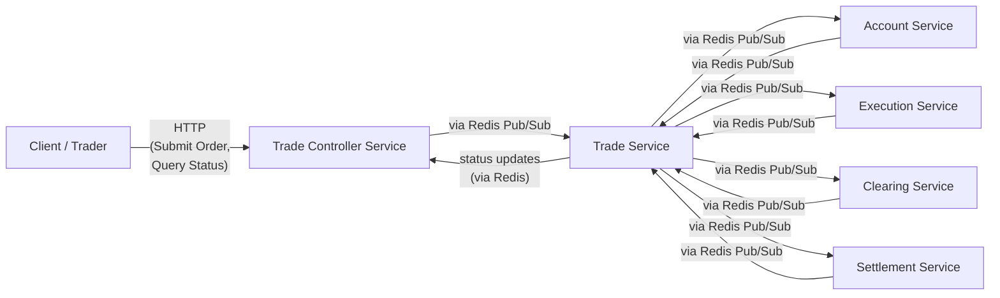
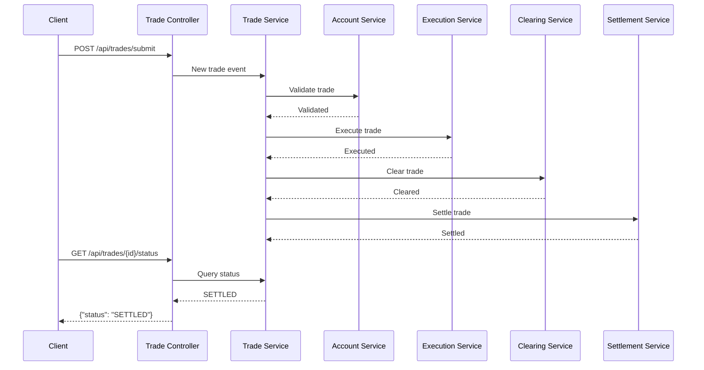
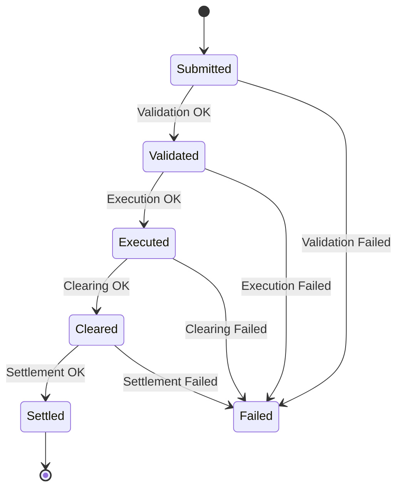

# KLEAR System

A microservice-based, event-driven demonstration trading platform for order submission, validation, execution, clearing, and settlement. The system is deliberately architected as a set of decoupled Spring Boot microservices communicating via Redis Pub/Sub, with a REST-facing Trade Controller as the entry point.



---

## Table of Contents

1. [Quick Start](#quick-start)
2. [Running Tests](#running-tests)
3. [Debugging](#debugging)
4. [System Overview](#system-overview)
5. [Services](#services)
6. [Architecture Deep Dive](#architecture-deep-dive)
7. [Trade Lifecycle](#trade-lifecycle)
8. [Building](#building)
9. [Running with Docker Compose](#running-with-docker-compose)
10. [Running Manually](#running-manually)
11. [Project Structure](#project-structure)
12. [Future Work](#future-work)
13. [Technology Stack](#technology-stack)

---

## Quick Start

Get from zero to "trade submitted" in under 5 minutes.

### Start the system

```bash
docker compose up
```

On first run, Docker will pull images and Maven will build modules inside containers. You'll see:

```text
klear-trade-controller | :: Spring Boot :: (v3.2.10)
klear-trade-service    | :: Spring Boot :: (v3.2.10)
...
klear-trade-controller | Tomcat started on port 8080 (http)
```

The REST API is live at `http://localhost:8080`.

For detached mode:

```bash
docker compose up -d
docker compose logs -f    # follow logs
```

### Submit a trade

```bash
curl -X POST http://localhost:8080/api/trades/submit \
  -H "Content-Type: application/json" \
  -d '{
        "clientId": "123456",
        "stockSymbol": "AAPL",
        "quantity": 100,
        "price": 150.0
      }'
```

Response:

```text
Order submitted successfully. Order ID: "6f8e3bb7-01ec-4ecf-81e7-f548be295485"
```

### Query order status

```bash
curl -X GET http://localhost:8080/api/trades/{ORDER_ID}/status
```

Response progresses through: `VALIDATED` → `EXECUTED` → `CLEARED` → `SETTLED`

### Watch the logs

```bash
docker compose logs -f | grep {ORDER_ID}
```

You'll see the trade flow through each service:

```text
klear-trade-controller  | Received order submission: clientId=123456 symbol=AAPL qty=100 price=150.0
klear-account-service   | Validated: 6f8e3bb7-01ec-4ecf-81e7-f548be295485
klear-execution-service | Executed:  6f8e3bb7-01ec-4ecf-81e7-f548be295485
klear-clearing-service  | Cleared:   6f8e3bb7-01ec-4ecf-81e7-f548be295485
klear-settlement-service| Settled:   6f8e3bb7-01ec-4ecf-81e7-f548be295485
```

### Stop the system

```bash
docker compose down
```

---

## Running Tests

The project includes 47 unit and integration tests across all modules.

### Run all tests

```bash
export JAVA_HOME=/usr/lib/jvm/java-21-openjdk
mvn clean test
```

### Test coverage by module

| Module | Tests | Description |
|--------|-------|-------------|
| shared-libs | 31 | Order, Trade, OrderStatus models; message serialization |
| account-service | 1 | Account validation logic |
| execution-service | 1 | Trade execution logic |
| clearing-service | 1 | Clearing logic |
| settlement-service | 1 | Settlement logic |
| trade-service | 6 | Trade orchestration, lifecycle integration |
| trade-controller | 5 | REST API endpoints via MockMvc |

### Run tests for a specific module

```bash
mvn test -pl shared-libs
mvn test -pl trade-service
mvn test -pl trade-controller -am    # -am includes dependencies
```

---

## Debugging

All services expose JDWP debug ports when running via Docker Compose.

### Debug ports

| Service | Port | Container |
|---------|------|-----------|
| trade-controller | 5005 | klear-trade-controller |
| trade-service | 5006 | klear-trade-service |
| account-service | 5007 | klear-account-service |
| execution-service | 5008 | klear-execution-service |
| clearing-service | 5009 | klear-clearing-service |
| settlement-service | 5010 | klear-settlement-service |

### IntelliJ remote debugging

1. Go to `Run` → `Edit Configurations...`
2. Click `+` → `Remote JVM Debug`
3. Set Host: `localhost`, Port: `<debug-port>` (e.g., 5005)
4. Start services with `docker compose up`
5. Attach debugger from IntelliJ

### Debugging Redis Pub/Sub

Monitor all Redis activity:

```bash
docker exec -it klear-redis redis-cli MONITOR
```

List active channels:

```bash
docker exec -it klear-redis redis-cli PUBSUB CHANNELS
```

Subscribe to a specific channel:

```bash
docker exec -it klear-redis redis-cli SUBSCRIBE trade_service_channel_OUT
```

Filter for PUBLISH commands:

```bash
docker exec -it klear-redis redis-cli MONITOR | grep PUBLISH
```

---

## System Overview

The KLEAR System demonstrates a trading platform with:

* **6 Microservices**: Trade Controller, Trade Service, Account, Execution, Clearing, Settlement
* **Event-driven communication**: Redis Pub/Sub with well-defined channels
* **Independent threading**: Inbound/outbound message processing decoupled
* **Scalability**: Designed for horizontal, vertical, and orthogonal scaling
* **Structured logging**: SLF4J with Logback

### Trade lifecycle flow

```
Client → Trade Controller (REST)
  → Trade Service (orchestrator)
  → Account Service → Trade Service (VALIDATED)
  → Execution Service → Trade Service (EXECUTED)
  → Clearing Service → Trade Service (CLEARED)
  → Settlement Service → Trade Service (SETTLED)
```

---

## Services

### Trade Controller Service (`trade-controller/`)

Public-facing REST API (port 8080).

* `POST /api/trades/submit` — Submit a new trade
* `GET /api/trades/{orderId}/status` — Query trade status

Lightweight and stateless. Publishes trade requests to Trade Service via Redis.

### Trade Service (`trade-service/`)

Core orchestrator managing the trade lifecycle state machine.

* Maintains in-memory `ConcurrentHashMap<String, Trade>` for trade status
* Coordinates with all downstream services
* State transitions: `UNKNOWN` → `VALIDATED` → `EXECUTED` → `CLEARED` → `SETTLED`

### Account Service (`services/account-service/`)

Validates account eligibility (margin, funds, limits). First stage after submission.

### Execution Service (`services/execution-service/`)

Simulates trade execution. In production: connects to exchanges/venues via smart order routing.

### Clearing Service (`services/clearing-service/`)

Handles post-trade clearing. In production: integrates with clearing houses.

### Settlement Service (`services/settlement-service/`)

Final settlement stage. In production: integrates with payment systems for asset/cash movements.

---

## Architecture Deep Dive

### Event-Driven Communication

Services communicate via Redis Pub/Sub, not direct calls:

* Service publishes to `{service}_channel_OUT`
* Target service subscribes to that channel
* Return messages use dynamic channels: `{service}_channel_RET_{UUID}`

### Threading Model

Each service uses a two-thread model:

* **Inbound thread**: Listens for incoming Redis messages
* **Outbound thread**: Sends messages to Redis

This decoupling maximizes throughput and prevents blocking.

### Scalability

* **Horizontal**: Run multiple instances; Redis load-balances messages
* **Vertical**: Increase resources; multi-threaded design uses them efficiently
* **Orthogonal**: Shard by asset class, region, or client group

### Fault Isolation

If one service fails, others continue:

* Settlement down? Trades queue at clearing stage
* Execution slow? Trades validated and waiting in Redis
* No cascading failures

---

## Trade Lifecycle

### Sequence Diagram



### State Machine



---

## Building

### Prerequisites

* Java 17+ (21 recommended)
* Maven 3.9+
* Docker and Docker Compose

### Set JAVA_HOME

```bash
export JAVA_HOME=/usr/lib/jvm/java-21-openjdk
```

### Build all modules

```bash
mvn clean install
```

### Build individual services

```bash
mvn clean install -pl shared-libs
mvn clean install -pl trade-controller
mvn clean install -pl trade-service
mvn clean install -pl services/account-service
mvn clean install -pl services/execution-service
mvn clean install -pl services/clearing-service
mvn clean install -pl services/settlement-service
```

---

## Running with Docker Compose

### Start all services

```bash
docker compose up
```

### Detached mode

```bash
docker compose up -d
docker compose logs -f
```

### Restart a specific service

```bash
docker compose up -d --force-recreate trade-controller
```

### Stop all services

```bash
docker compose down
```

---

## Running Manually

### Start Redis

```bash
docker run -d -p 6379:6379 --name klear-redis redis:7-alpine
```

### Start each service (6 terminals)

```bash
# Trade Controller
cd trade-controller && mvn spring-boot:run

# Trade Service
cd trade-service && mvn spring-boot:run

# Account Service
cd services/account-service && mvn spring-boot:run

# Execution Service
cd services/execution-service && mvn spring-boot:run

# Clearing Service
cd services/clearing-service && mvn spring-boot:run

# Settlement Service
cd services/settlement-service && mvn spring-boot:run
```

---

## Project Structure

```
KlearSystem/
├── pom.xml                      # Parent POM
├── docker-compose.yml           # Docker orchestration
├── shared-libs/                 # Shared models and communication layer
│   └── src/main/java/com/klear/
│       ├── communication/core/  # ServiceClient, message types
│       └── model/               # Order, Trade, OrderStatus
├── trade-controller/            # REST API (port 8080)
├── trade-service/               # Lifecycle orchestrator
└── services/
    ├── account-service/         # Validation
    ├── execution-service/       # Execution
    ├── clearing-service/        # Clearing
    └── settlement-service/      # Settlement
```

### Channel Names

| Service | Channel |
|---------|---------|
| Trade Service | `trade_service_channel` |
| Account Service | `account_service_channel` |
| Execution Service | `execution_service_channel` |
| Clearing Service | `clearing_service_channel` |
| Settlement Service | `settlement_service_channel` |

---

## Future Work

### Completed

* **Structured logging**: SLF4J with Logback implemented across all services
* **Graceful shutdown**: `@PreDestroy` handlers with proper thread termination
* **Unit and integration tests**: 71 tests covering models, services, REST API, and failure scenarios
* **Non-happy path handling**: Validation failures at each lifecycle stage with proper error propagation

### Planned
* **Service discovery**: Eureka, Consul, or cloud-native equivalents
* **Resilience patterns**: Circuit breakers (Resilience4j), retries, bulkheads
* **Observability**: Metrics (Micrometer), distributed tracing (Zipkin/Jaeger)
* **Security**: Authentication, authorization, TLS
* **Production integrations**: Real venues, clearing houses, payment systems
* **AWS deployment**: VPC with public/private subnet segmentation

---

## Technology Stack

| Component | Technology |
|-----------|------------|
| Language | Java 17+ (21 tested) |
| Framework | Spring Boot 3.2.10 |
| Message Broker | Redis 7 (Jedis client) |
| Build | Maven 3.9.9+ |
| Containers | Docker, Docker Compose |
| Serialization | Jackson (JSON) |
| Logging | SLF4J + Logback |
| Testing | JUnit 5, Mockito, Spring MockMvc |

---

## API Reference

### Submit Order

```http
POST /api/trades/submit
Content-Type: application/json

{
  "clientId": "123456",
  "stockSymbol": "AAPL",
  "quantity": 100,
  "price": 150.0
}
```

**Response** (201 Created):
```
Order submitted successfully. Order ID: "uuid-here"
```

### Get Order Status

```http
GET /api/trades/{orderId}/status
```

**Response** (200 OK):
```
Order Status: SETTLED
```

**Response** (404 Not Found):
```
Order not found. Order ID: invalid-id
```

---

## License

This is a demonstration project for educational purposes.